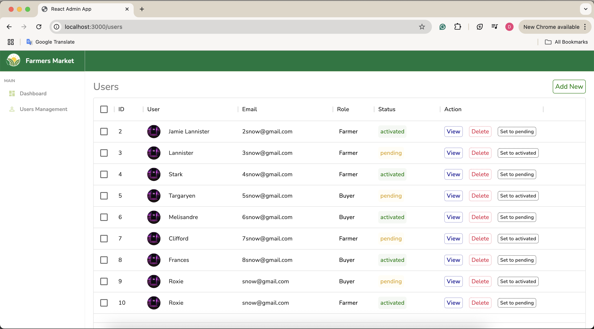
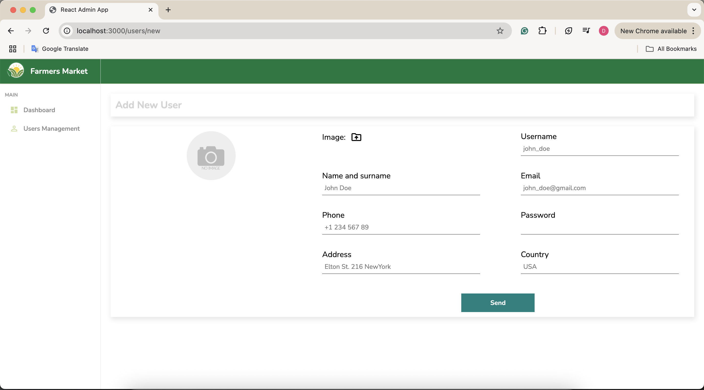
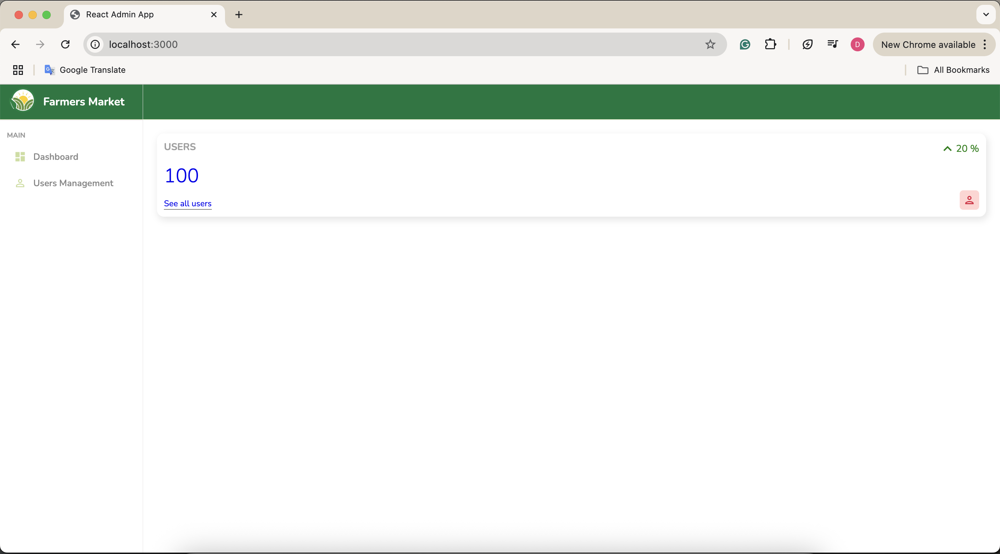

# farmers-market-admin
A frontend-only web application built with React, designed to manage user information on a Farmers Market platform.  The project features a simple dashboard-style layout, with UI components such as data tables, charts, and status indicators.

### UI Preview

<p align="center">
  
  
  
</p>

## To run locally:

1. Clone the repository:
```bash
   git clone https://github.com/dilyaraarynova/farmers-market-admin.git
   cd farmers-market-admin
```
2. Install dependencies:
```bash
   npm install
```
3. Start:
```bash
   npm run start
```
6. Visit: `http://localhost:3000/`

## Author

Made by Dilyara Arynova
